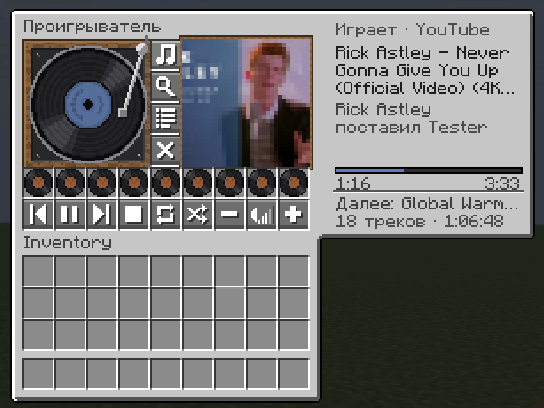
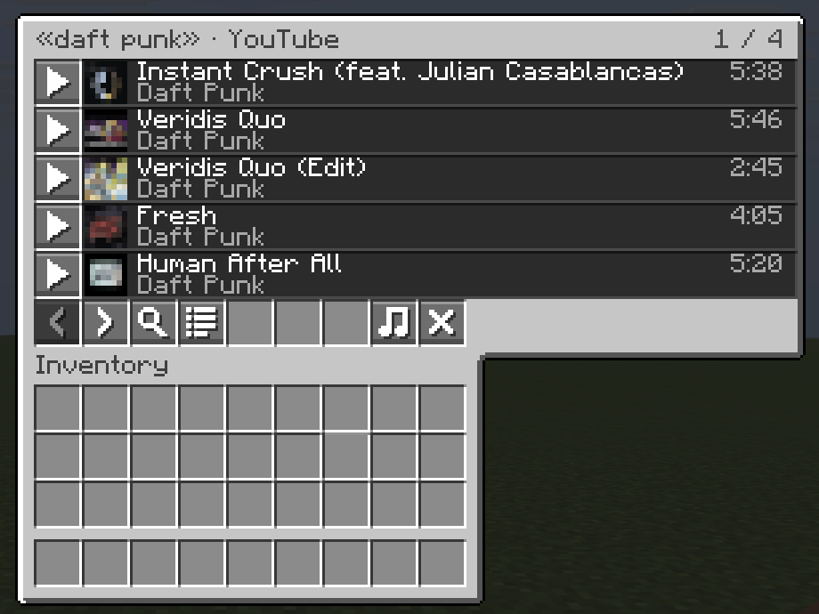
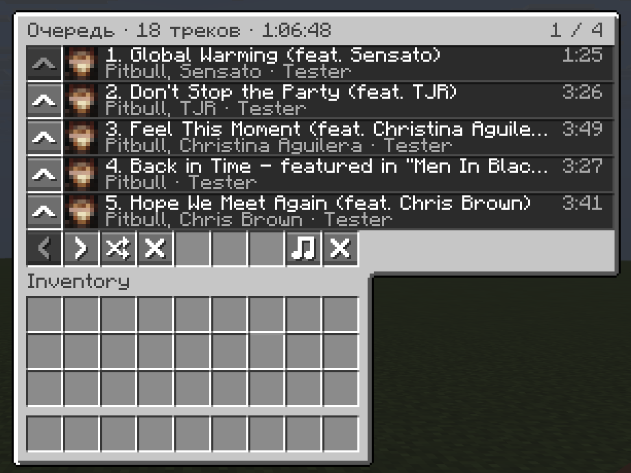
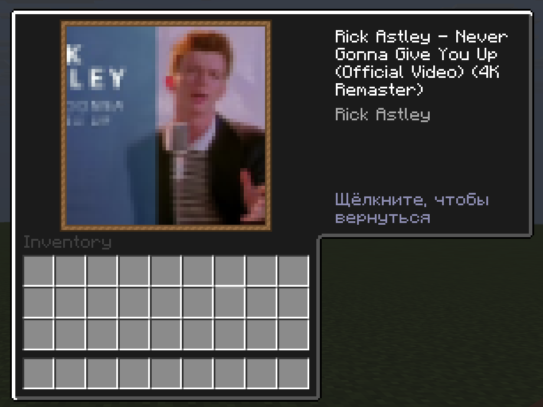

# JukeboxRadio

Плагин для Paper 26.3 и серверный мод для Fabric 26.3: превращает проигрыватель (jukebox) в
радио. **Shift + ПКМ** по проигрывателю открывает меню, звук идёт через Simple Voice Chat от самого
блока — его слышат все игроки рядом. Меню — ванильное окно сундука, которое плагин целиком
перерисовывает своим ресурс-паком; никаких GUI-плагинов не нужно.



- ссылки **Spotify**: треки, альбомы, плейлисты (включая чужие и редакционные), исполнители;
- ссылки **YouTube**: видео и плейлисты (`youtube.com`, `youtu.be`, `music.youtube.com`);
- ссылки **Apple Music** (`music.apple.com`): треки, альбомы, плейлисты (первые 100 треков), исполнители
  (25 популярных треков); ключи не нужны;
- **поиск** по всему каталогу Spotify прямо в меню (или по YouTube Music, если нет ключей);
- общая очередь на проигрыватель: хотбар из следующих пластинок, вкладка «Очередь» с перемещением,
  удалением, перемешиванием, повтором;
- в меню: пластинка на проигрывателе с тонармом, при смене трека старый диск выскакивает, новый
  вылетает из слота очереди и начинает крутиться; **центр диска окрашивается в цвет обложки**;
  обложка висит в рамке «карты», по щелчку открывается крупно (64×64).

## Что нужно на сервере

| Что | Зачем |
|---|---|
| Paper 26.3 или Fabric 26.3 + Fabric API (Java 25) | ядро |
| [Simple Voice Chat](https://modrinth.com/plugin/simple-voice-chat) (Bukkit/Paper или Fabric) | звук |
| yt-dlp | скачивается автоматически (см. ниже) |
| открытый TCP-порт 8166 | раздача ресурс-пака меню (можно выложить пак самому, см. ниже) |

Игрокам нужен мод Simple Voice Chat, чтобы слышать музыку, и ресурс-пак радио (сервер отправит
его сам при входе), чтобы видеть меню.

## Установка

1. Paper: положите `JukeboxRadio-1.2.jar` в `plugins/` рядом с voicechat.
   Fabric: положите `JukeboxRadio-fabric-1.2.jar` в `mods/` рядом с voicechat и Fabric API
   (мод нужен только на сервере). Ниже пути даны для Paper; на Fabric всё то же самое лежит
   в `config/jukeboxradio/`.
2. Запустите сервер — появится `plugins/JukeboxRadio/config.yml`.
3. (Желательно) впишите ключи Spotify, чтобы работал поиск по Spotify:
   откройте https://developer.spotify.com/dashboard → *Create app* → скопируйте *Client ID* и
   *Client Secret* в `spotify.client-id` / `spotify.client-secret`.
4. Укажите `pack.public-address` — IP или домен, по которому игроки заходят на сервер, и откройте
   порт `pack.port` (8166, TCP). Перезапустите сервер.

### Ресурс-пак меню

Плагин сам генерирует пак (≈870 КБ, формат 26.3) в `plugins/JukeboxRadio/pack/jukeboxradio.zip` и
отправляет его при входе как **дополнительный** — серверный пак (ItemsAdder, Oraxen и т. п.) не
заменяется. Способы доставки (`pack.mode`):

- `self-host` (по умолчанию) — встроенный HTTP-сервер плагина на `pack.port`;
- `external` — выложите zip куда угодно и впишите ссылку в `pack.external-url`;
- `none` — влейте zip в свой серверный пак сами (всё лежит в пространстве имён `jukeboxradio`).

Если игрок отказался от пака, меню не откроется (вместо графики были бы квадраты) — плагин
подскажет включить наборы ресурсов сервера; команды `/radio` работают и без пака.

`menu.theme: dark` рисует то же меню в тёмной палитре: почти чёрные панели со скруглёнными
углами, плоские слоты, тёмные кнопки, светлый текст. По умолчанию — `vanilla`.

На Fabric пак отправляется сразу после входа (у Paper — ещё в фазе конфигурации), а взрывы, огонь и
поршни замечаются проверкой раз в две секунды: Fabric API не сообщает о них событиями.

Флаг JVM `--enable-native-access=ALL-UNNAMED` убирает предупреждение Java 25 о нативных
библиотеках декодера (без него всё работает).

## Как пользоваться

- **Shift + ПКМ** по проигрывателю — открыть, Esc или ✕ — закрыть. Музыка продолжает играть.
- Колонка кнопок между проигрывателем и обложкой: «Играет», «Поиск», «Очередь», «Закрыть».
- «Поиск» открывает окно ввода: вставьте ссылку Spotify/Apple Music/YouTube или напишите запрос → «Найти».
  В результатах ▶ — играть сразу, ЛКМ по строке — в очередь, ПКМ — играть сразу, «Добавить все» —
  весь плейлист/альбом.
- Ряд дисков под проигрывателем — следующие треки: ЛКМ — играть сейчас, ПКМ — убрать.
- Щелчок по обложке открывает её крупно. Нижний ряд: назад, пауза, дальше, стоп, повтор,
  перемешать, громкость. Каждый игрок может ещё приглушить радио у себя в настройках Voice Chat
  (ползунок «Радио»).

| Поиск | Очередь | Обложка |
|---|---|---|
|  |  |  |

Скриншоты сняты в настоящем клиенте 26.3 на тестовом сервере.

Команды (удобно для длинных ссылок из буфера обмена):

```
/radio play <ссылка или запрос>   — в очередь проигрывателя, на который вы смотрите
/radio search <запрос>            — открыть меню с результатами
/radio skip | pause | stop | volume <0-100> | status | open
/radio stopall                    — остановить всё (право jukeboxradio.admin)
```

Для админов (и консоли): `/radio open <игрок> <x> <y> <z>` — открыть проигрыватель игроку,
`/radio as <игрок> <команда…>` — выполнить подкоманду от его имени, `/radio as <игрок> click <слот>` —
нажать слот меню (диагностика).

Права: `jukeboxradio.use` (по умолчанию всем), `jukeboxradio.admin` (операторам).

### Нотные блоки-повторители

У каждого проигрывателя есть **код связи** — он в подсказке вкладки «Проигрыватель» и по команде
`/radio code`. **Shift + ПКМ по нотному блоку** открывает окно: введите код, выставьте громкость
этого блока и нажмите «Подключить». Нотный блок начнёт играть то же, что проигрыватель, кадр в кадр,
и его будет слышно на `radio.distance` вокруг; громкость блока умножается на громкость проигрывателя.

Подключиться можно, если нотный блок не дальше `relay.range` (48) блоков от проигрывателя или от
другого работающего повторителя той же сети — каждый повторитель продлевает зону, как Wi-Fi. Если
убрать блок из середины цепочки, дальние замолкают, но код помнят и заиграют, когда цепочку
восстановят. Работающие повторители пускают ноты над собой. На один проигрыватель —
до `relay.max-per-jukebox` (16) нотных блоков. Связи хранятся в `plugins/JukeboxRadio/links.yml` и
переживают рестарт; сдвинутый поршнем нотный блок уносит связь с собой.

Клиент Simple Voice Chat копит задержку каждого звука отдельно (после подвисания сети пакеты ждут
в очереди), и проигрыватель с повторителями со временем расходятся. Поэтому, пока у проигрывателя
есть повторители, плагин в тихий момент — между треками, в паузе — заканчивает все их потоки
одновременно, и клиенты начинают их заново в такт: не чаще раза в 30 секунд, с новым повторителем —
в ближайшую тишину, а если тишины нет, через 4 минуты на любом кадре (короткий провал ~60 мс).

В поиске кнопка «Искать альбомы и плейлисты» переключает его на альбомы и плейлисты YouTube Music
(так же ищутся, даже если основной поиск — Spotify). ЛКМ по результату открывает список треков,
ПКМ или «+» слева сразу ставит весь альбом в очередь.

## Откуда берётся звук

Spotify не отдаёт аудио сторонним приложениям, поэтому для каждого трека плагин ищет запись на
**YouTube Music** по исполнителю, названию и длительности (оригинал «- Topic» в приоритете,
live/cover/remix/slowed отсеиваются). Прямой аудиопоток достаёт **yt-dlp**, декодирует lavaplayer,
Simple Voice Chat проигрывает у блока. Следующий трек подготавливается заранее.

Так же играют ссылки Apple Music: треки, альбомы и исполнители читаются из открытого iTunes Lookup
API, плейлисты — из данных страницы `music.apple.com`, а звук ищется на YouTube Music.

yt-dlp: если его нет в `PATH` и не указан `audio.yt-dlp.path`, плагин скачивает официальный релиз
с GitHub в `plugins/JukeboxRadio/bin/` и проверяет его по `SHA2-256SUMS` того же релиза, а при
каждом старте обновляет (`yt-dlp -U`). Выключается `audio.yt-dlp.auto-download: false`.
Если YouTube начнёт требовать вход («Sign in to confirm you're not a bot»), передайте yt-dlp
cookies: `audio.yt-dlp.extra-args: ["--cookies", "/path/cookies.txt"]`.

Трек yt-dlp скачивает целиком в `plugins/JukeboxRadio/cache/` (кусками, на полной скорости), и
lavaplayer играет его с диска: одну длинную ссылку YouTube режет до скорости воспроизведения, и звук
заикается. Следующий трек очереди скачивается заранее. Размер кэша — `audio.cache-mb` (по умолчанию
512 МБ, старые файлы удаляются), `0` — играть по ссылке. Видео длиннее 20 минут всегда идут по ссылке.
Между воспроизведением и голосовым чатом — буфер: звук стартует, когда накоплено 1,2 с, и держит до
10 с запаса.

Если YouTube с сервера не открывается (например, в РФ), задайте HTTP-прокси:
`network.proxy: "http://127.0.0.1:3128"`. Через него идут все запросы плагина: yt-dlp, загрузка
аудиопотока и поиск YouTube в lavaplayer, Spotify и обложки. Поддерживается только `http://` без
логина: встроенный HTTP-клиент Java не умеет SOCKS. Удобная схема: прокси за границей слушает
только localhost, а до сервера его доводит SSH-туннель (`ssh -N -L 127.0.0.1:3128:127.0.0.1:3128 …`).

## Ограничения Spotify (важно)

С февраля–марта 2026 Spotify урезал Web API для приложений в Development Mode:

- поиск отдаёт не больше 10 результатов за запрос (меню листает по 5);
- треки плейлиста доступны только для плейлистов владельца приложения;
- у треков убраны ISRC и популярность; владельцу приложения нужен Premium.

Поэтому плейлисты, альбомы и исполнители читаются с публичных embed-страниц
`open.spotify.com/embed/...` (до ~100 треков), а обложки недостающих треков — через oEmbed.
Если Spotify и это закроет, слой каталога заменяется целиком (см. ниже).

## Своя музыкальная платформа вместо Spotify

Метаданные и звук разделены. Всё, что знает интерфейс и очередь, — это `TrackMeta`
(название, исполнители, альбом, длительность, обложка, ссылка). Чтобы подключить другой сервис
поиска музыки:

1. Реализуйте `su.nuv.radio.catalog.MusicCatalog`:
   `id()`, `displayName()`, `canResolve(link)`, `resolve(link)`, `supportsSearch()`,
   `search(query, offset, limit)` и при желании `enrich(track)` (догрузка обложки).
   Работайте асинхронно (`CompletableFuture`), сеть — через `su.nuv.radio.util.Http`.
2. Зарегистрируйте его в `RadioPlugin#buildCatalogs()`.
3. Укажите его `id()` в `catalog.search-provider`.

Если сервис сам отдаёт ссылку на поток, положите её в `TrackMeta.streamRef` — она проиграется
напрямую; иначе трек будет найден на YouTube Music, как сейчас треки Spotify.

## Как устроено меню

Окно сундука 9×6 плюс панель справа. Всё неподвижное — фон, тексты, полоса прогресса, большая
обложка — рисуется глифами шрифтов в **заголовке окна**; заголовок обновляется на месте
(пакетом open-screen для того же окна), поэтому курсор не прыгает. Всё интерактивное лежит в
**слотах** как предметы со своими моделями: кнопки, пластинка (16 кадров вращения, центр
окрашивается через `custom_model_data`), тонарм, диски очереди и обложка — 16 «плиток» по 8×8
пикселей, у каждого пикселя свой цвет. Анимации (выброс и влёт пластинки, сдвиг очереди,
проявление обложки, ход тонарма) — это смена моделей предметов по тикам.

Тексты в заголовке сдвигаются по вертикали копиями ванильных шрифтов, по одной на каждую строку
пикселей (~137 шрифтов). Клиент нарезает каждый глиф каждой копии при загрузке ресурсов, поэтому
копии урезаны до латиницы с европейскими диакритиками, кириллицы и нужной пунктуации
(`Glyphs.inMenuCharset`): ~61 тыс. глифов вместо ~330 тыс. Остальные буквы (греческий, CJK…)
в меню показываются как `?`.

## Сборка

```bash
./gradlew build
```

Gradle сам скачает JDK 25. Плагин для Paper появится в `paper/build/libs/`, мод для Fabric — в
`fabric/build/libs/`. Тесты:

```bash
./gradlew test
```

Проверка сети целиком
(Spotify → YouTube Music → yt-dlp → PCM): `./gradlew test -Plive -Pytdlp=/path/to/yt-dlp`.

## Устройство

Три модуля Gradle: `core` не знает ни о Bukkit, ни о Fabric и работает через интерфейсы
`su.nuv.radio.platform` (планировщик, игроки, блоки, окно-сундук, диалог, отправка пака);
`paper` и `fabric` реализуют их и пересылают события своей платформы в `su.nuv.radio.Radio`.

```
core/    su.nuv.radio
├── Radio      сборка сервисов и события платформы (блок нажат, сломан, игрок вышел…)
├── platform/  что ядру нужно от сервера: RadioPlatform, RadioPlayer, MenuView, DialogSpec
├── catalog/   универсальный слой метаданных: MusicCatalog, Spotify, YouTube, реестр
├── audio/     lavaplayer, поиск записи на YouTube Music, yt-dlp, PCM 48 кГц
├── voice/     Simple Voice Chat: канал у блока, категория громкости
├── station/   очередь, воспроизведение, повтор, история
├── menu/      меню-сундук: экраны, анимации, клики, диалог поиска, темы
├── menu/pack/ генерация ресурс-пака (графика, шрифты, модели) и его раздача
├── menu/text/ сборка заголовка-«экрана», метрики ванильного шрифта
├── menu/art/  обложки: загрузка, уменьшение, цвет этикетки
└── relay/, command/, config/
paper/   su.nuv.radio.paper — плагин: события Bukkit, инвентарь, диалоги Paper, обновление заголовка
fabric/  su.nuv.radio.fabric — мод: события Fabric API, ChestMenu, ванильные диалоги, Brigadier
```

План и журнал работы — `PLAN.md`, продуктовый контекст — `PRODUCT.md`.
